# Task Management System

<p align="center">
  
  
  
  
</p>

<p align="center">
A full-stack role-based Task Management platform for Admins, Managers, and Employees, built with Spring Boot and React.
</p>

---

## Overview

This project helps teams plan, assign, and track projects in a simple workflow:

- Admin creates projects.
- Admin assigns projects to managers.
- Managers assign projects to employees.
- Employees update project status.

The application is split into two apps:

- **Backend**: REST APIs, authentication, business logic, database access.
- **Frontend**: Responsive React UI for user and project operations.

---

## Key Features

- Role-based user flow: Admin, Manager, Employee
- User registration and login with JWT generation
- Password change support
- Soft-delete for users
- Create, search, and fetch projects
- Assign projects to managers and employees
- Employee project status updates
- Swagger-enabled API documentation
- MySQL support with optional H2 local profile

---

## Tech Stack

| Layer          | Technology                                                   |
| -------------- | ------------------------------------------------------------ |
| Frontend       | React 18, React Router, Axios, React Toastify                |
| Backend        | Java 8, Spring Boot 2.7.18, Spring Security, Spring Data JPA |
| Authentication | JWT (jjwt)                                                   |
| Database       | MySQL 8 (default), H2 (local profile)                        |
| API Docs       | Swagger 2 (Springfox)                                        |
| Build Tools    | Maven, npm                                                   |

---

## Screens And Workflow

<p align="center">
  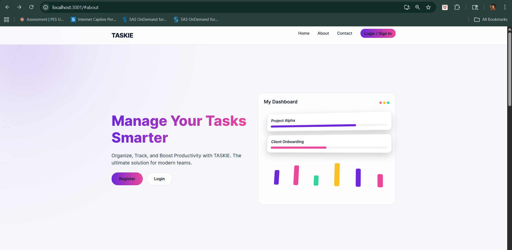
  <br />
  <em>Homepage - Main landing view introducing the platform and core value.</em>
</p>

<p align="center">
  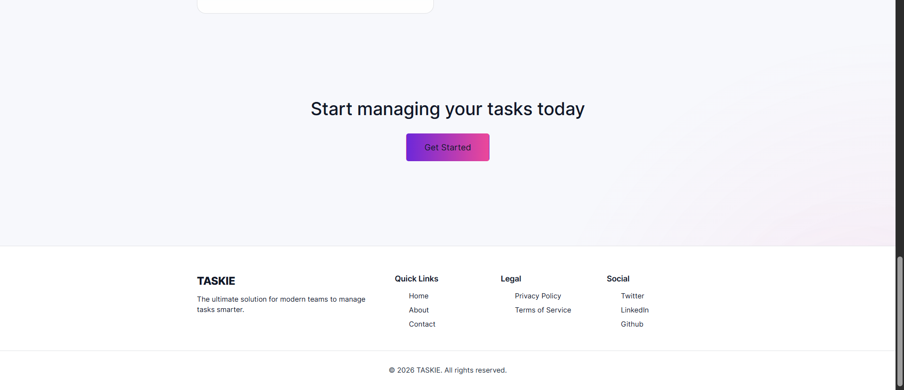
  <br />
  <em>Homepage - Extended section with additional highlights and calls to action.</em>
</p>

<p align="center">
  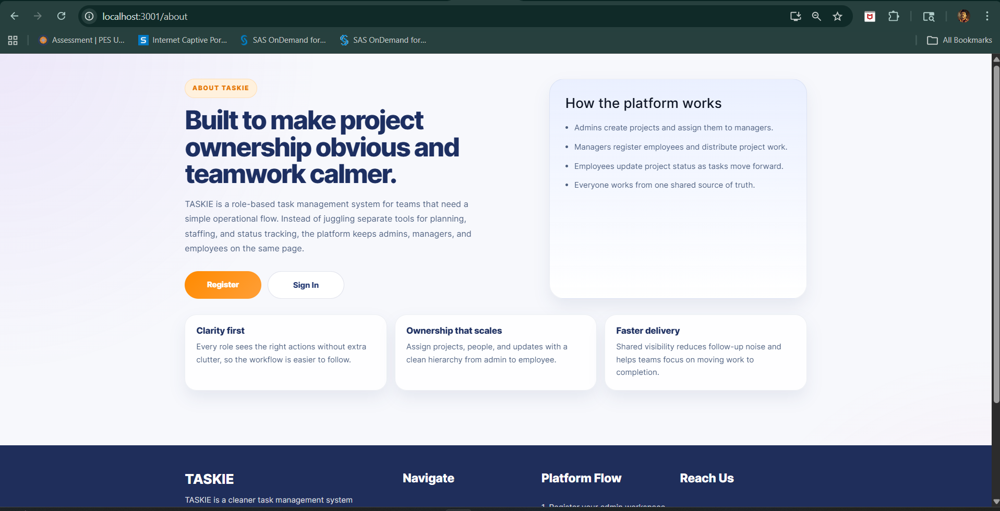
  <br />
  <em>About - Project and team information page.</em>
</p>

<p align="center">
  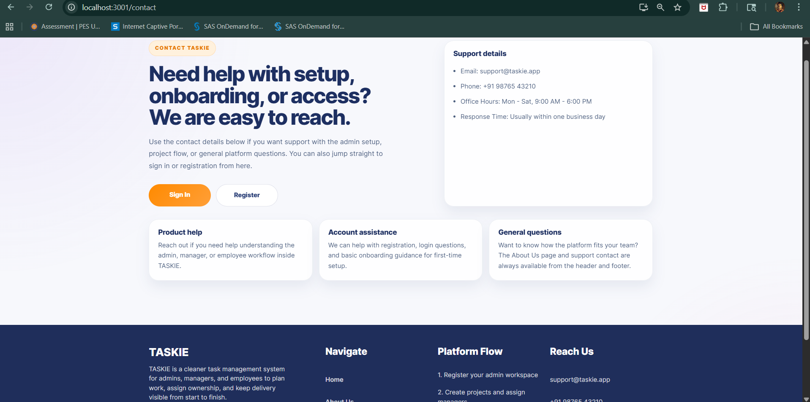
  <br />
  <em>Contact - Communication page for user queries and support.</em>
</p>

<p align="center">
  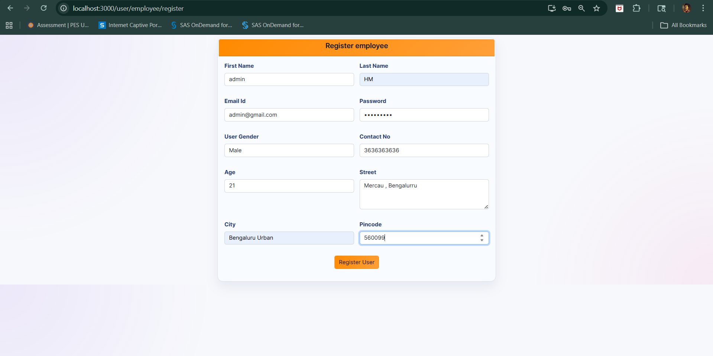
  <br />
  <em>Register - New user onboarding for Admin, Manager, and Employee roles.</em>
</p>

<p align="center">
  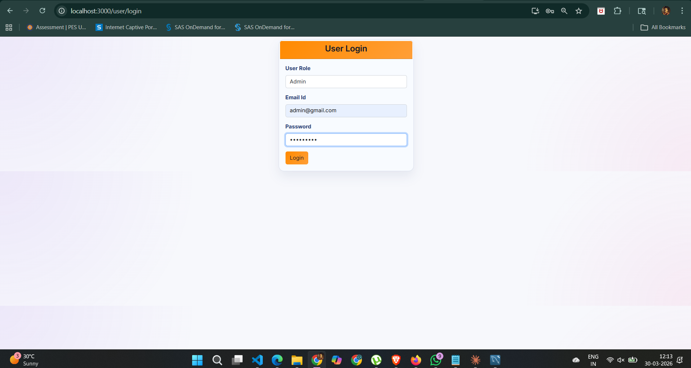
  <br />
  <em>Admin Login - Secure sign-in for administrators.</em>
</p>

<p align="center">
  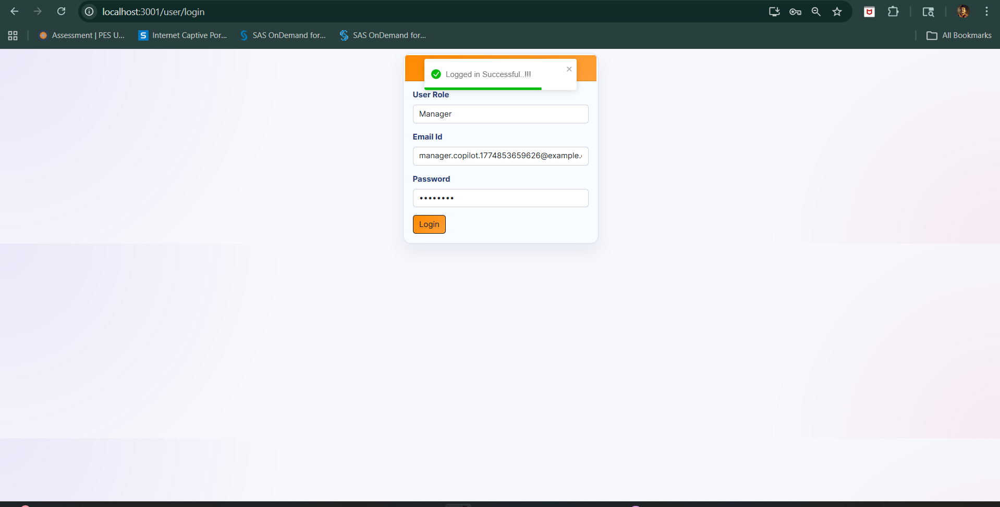
  <br />
  <em>Manager Login - Role-based login for managers.</em>
</p>

<p align="center">
  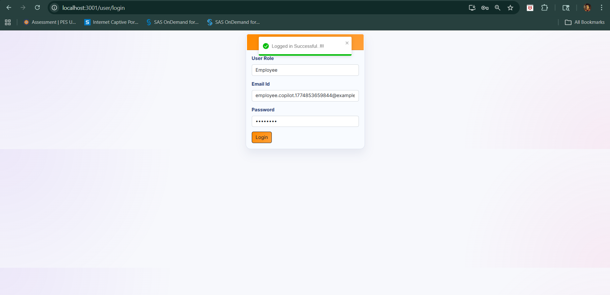
  <br />
  <em>Employee Login - Authentication screen for employees.</em>
</p>

<p align="center">
  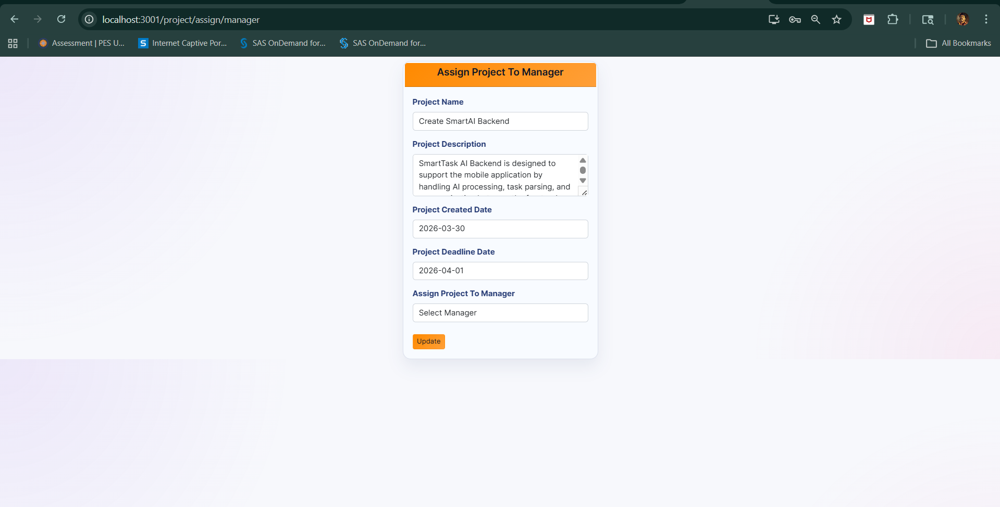
  <br />
  <em>Admin Project Creation - Form for creating a new project.</em>
</p>

<p align="center">
  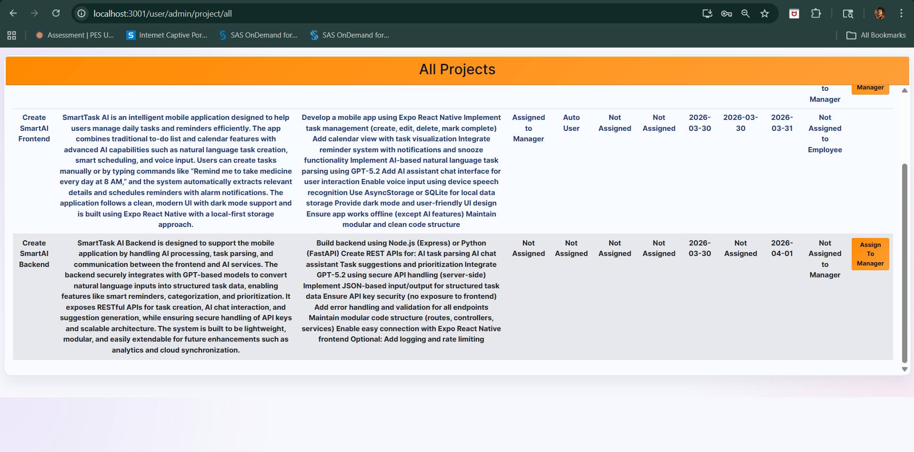
  <br />
  <em>Project Added - Confirmation view after successful project creation.</em>
</p>

<p align="center">
  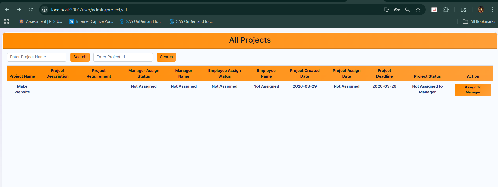
  <br />
  <em>Admin Dashboard - Project list where assignments have not started yet.</em>
</p>

<p align="center">
  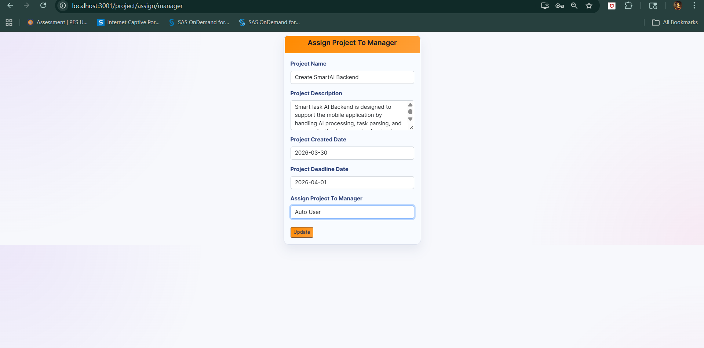
  <br />
  <em>Assign To Manager - Admin maps a project to a manager.</em>
</p>

<p align="center">
  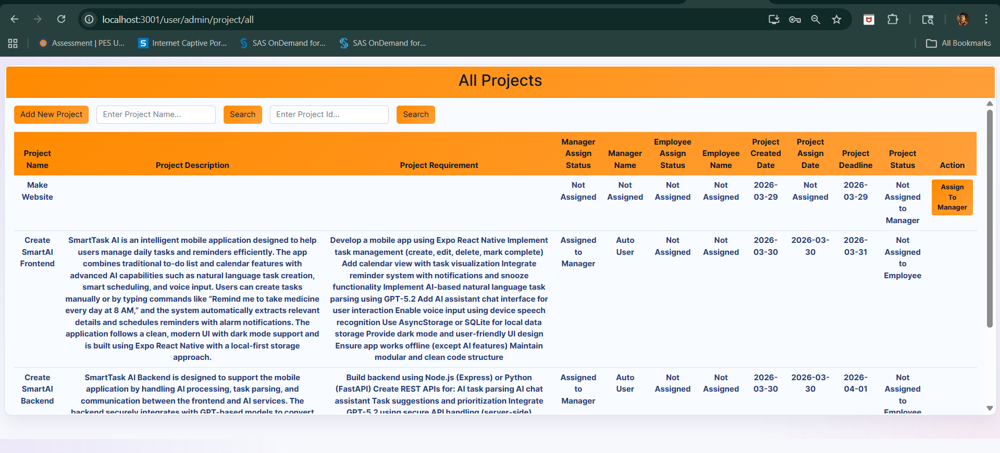
  <br />
  <em>Manager Assignment Status - Project state after manager assignment.</em>
</p>

<p align="center">
  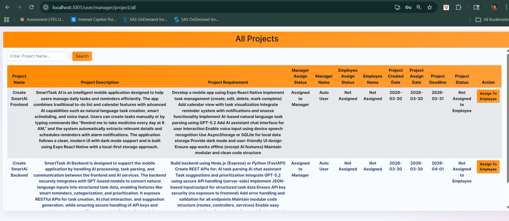
  <br />
  <em>Manager Dashboard - Manager view before assigning work to employees.</em>
</p>

<p align="center">
  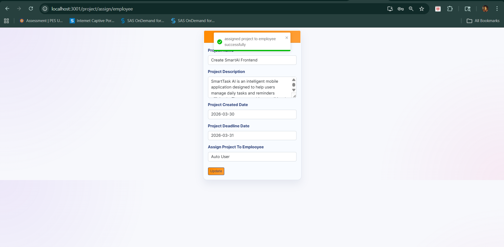
  <br />
  <em>Assign To Employee - Manager assigns project execution to an employee.</em>
</p>

<p align="center">
  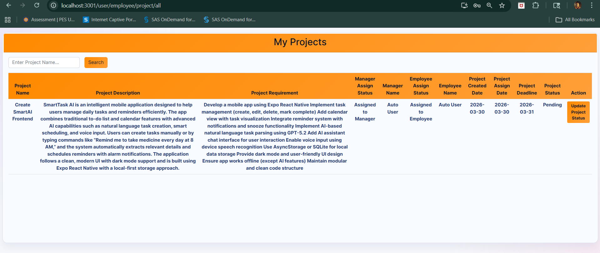
  <br />
  <em>Employee Task Board - Employee sees assigned projects and task details.</em>
</p>

<p align="center">
  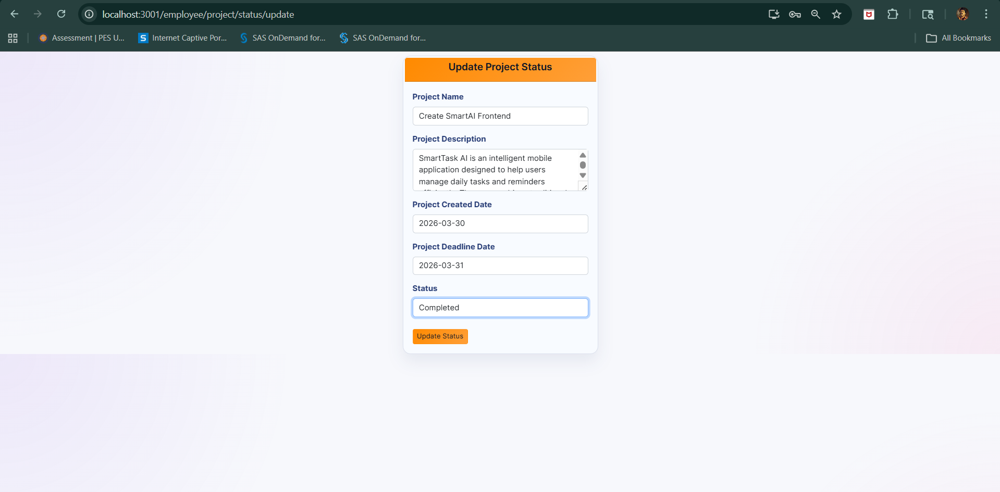
  <br />
  <em>Status Update - Employee updates current project status.</em>
</p>

<p align="center">
  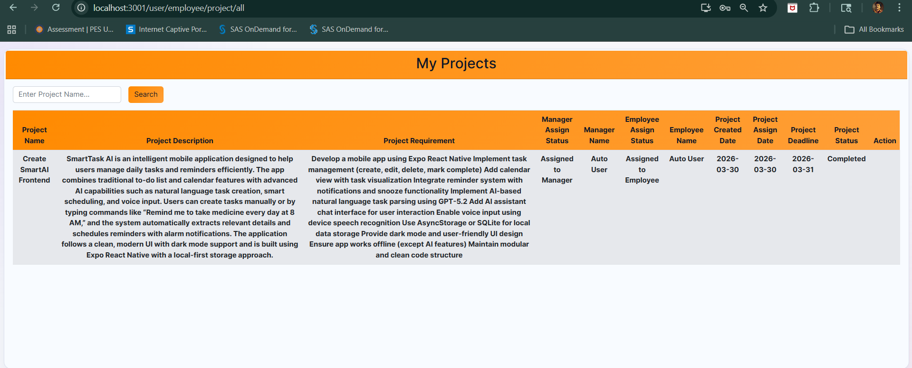
  <br />
  <em>Completed Workflow - Final completed state after end-to-end task lifecycle.</em>
</p>

---

## Architecture

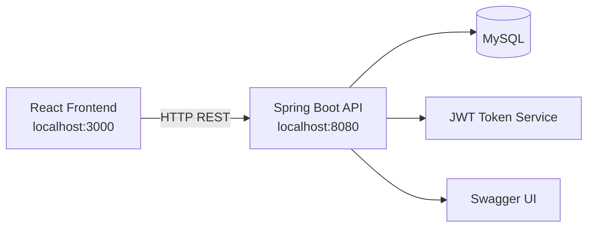

---

## Project Structure

```text
TASK-MANAGEMENT/
|-- backend/
|   |-- src/main/java/com/taskmanagement/
|   |-- src/main/resources/
|   |-- pom.xml
|-- frontend/
|   |-- src/
|   |-- public/
|   |-- package.json
|-- README.md
```

---

## Getting Started

### Prerequisites

- Java 8
- Maven 3.8+
- Node.js 18+ and npm
- MySQL 8 (for default backend profile)

### 1) Clone Repository

```bash
git clone https://github.com/Abuthwahir/task-management-system-using-springboot.git
cd task-management-system-using-springboot
```

### 2) Start Backend

Go to backend folder:

```bash
cd backend
```

#### Option A: Run with MySQL (default)

Make sure MySQL is running, then update env variables if needed:

- `DB_URL` (default: `jdbc:mysql://localhost:3306/task_management_system?createDatabaseIfNotExist=true&useUnicode=true`)
- `DB_USERNAME` (default: `root`)
- `DB_PASSWORD` (default: empty)
- `JWT_SECRET` (recommended: set your own secure secret)

Run backend:

```bash
# Linux/Mac
./mvnw spring-boot:run

# Windows
mvnw.cmd spring-boot:run
```

#### Option B: Run with H2 local profile

```bash
# Linux/Mac
./mvnw spring-boot:run -Dspring-boot.run.profiles=local

# Windows
mvnw.cmd spring-boot:run -Dspring-boot.run.profiles=local
```

Backend starts at: **http://localhost:8080**

### 3) Start Frontend

Open a new terminal:

```bash
cd frontend
npm install
npm start
```

Frontend starts at: **http://localhost:3000**

---

## API Documentation

When backend is running:

- Swagger UI: **http://localhost:8080/swagger-ui.html**
- OpenAPI JSON: **http://localhost:8080/v2/api-docs**

---

## Main API Groups

### User APIs

- `GET /api/user/gender`
- `POST /api/user/admin/register`
- `POST /api/user/manager/register`
- `POST /api/user/employee/register`
- `POST /api/user/login`
- `POST /api/user/changePassword`
- `DELETE /api/user/delete?userId={id}`
- `GET /api/user/manager/all`
- `GET /api/user/employee/all`

### Project APIs

- `POST /api/project/add`
- `POST /api/project/update`
- `GET /api/project/fetch`
- `GET /api/project/search?projectName={name}`
- `GET /api/project/search/id?projectId={id}`
- `GET /api/project/fetch/manager?managerId={id}`
- `GET /api/project/fetch/employee?employeeId={id}`
- `GET /api/project/manager/search?projectName={name}&managerId={id}`
- `GET /api/project/employee/search?projectName={name}&employeeId={id}`
- `GET /api/project/allStatus`

---

## Useful Commands

### Frontend

```bash
npm start
npm test
npm run build
```

### Backend

```bash
mvnw.cmd test
mvnw.cmd spotless:check
mvnw.cmd spotless:apply
```

---

## Security Notes

- Current backend security config permits all routes while JWT utilities are available.
- For production, enforce authorization rules per role and secure secrets via environment variables.

---

## Roadmap

- Enforce role-based endpoint authorization in Spring Security config
- Centralize frontend API base URL via environment variables
- Add refresh-token flow
- Improve test coverage for service and controller layers
- Add Docker support for one-command local startup

---

## Contributing

1. Fork the repository
2. Create a feature branch
3. Commit your changes
4. Open a pull request

---

## Author

Built by **Abuthwahir**

If this project helped you, consider giving it a star.
